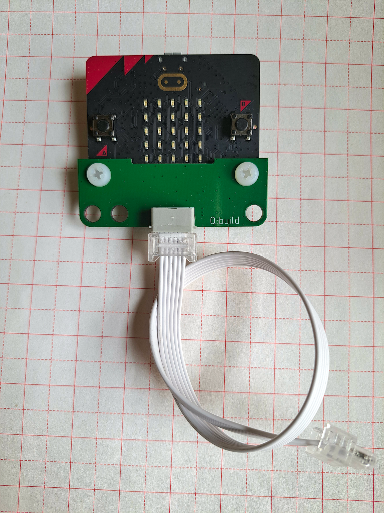
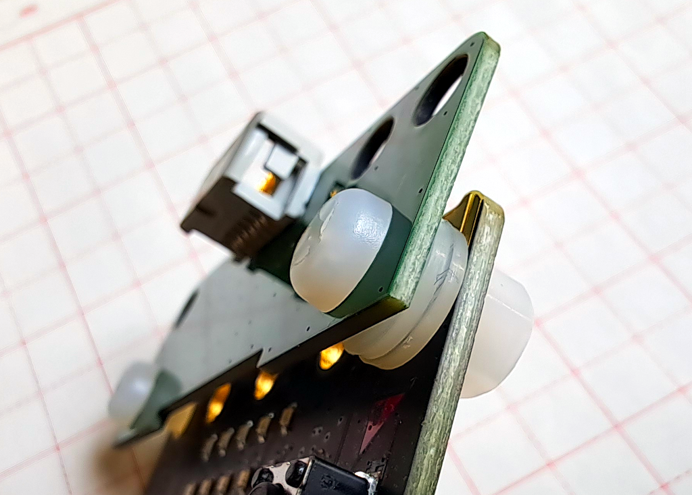

[简体中文](./README_cn.md)

# Q:build

Q:build is a Micro:bit V2 add-on board that turns a Micro:bit into a device that can be plugged into and works with a Raspberry Pi Build HAT. 
Q:build was designed and tested specifically for Build HAT, but *should* work with other hubs as well. 

Micro:bit has a variety of peripherals on board, including user interfacing devices such as buttons, the LED display and the speaker, 
as well as radio or Bluetooth (BLE) communication, and sensors such as the magnetic and accelerometer sensor. With Q:build, all Micro:bit features and sensor data are available to the application.

In addition, Q:build provides a high-performance gyro sensor for demanding application scenarios, such as when the Micro:bit on-board accelerometer is not sufficient.

## Installation

Q:build is very easy to install. Secure Q:build to Micro:bit with 2 bolts (supplied in the product kit), then plug the other end of the cable into one of the ports of your hub, and you're ready to go.

One thing to be aware of is that there have to be **2** spacers placed around the **left** bolt to keep proper spacing between Q:build and Micro:bit boards. See picture below. The right bolt needs no spacers.

## Micro:bit Firmware

Users are expected to build the Micro:bit firmware on their own, however we provide a MakeCode extension to make this process as easy as possible. Check the extension repository to find detailed information, including development guides, API references and sample programs:

    https://github.com/imq-open/pxt-qbuild

## License

Q:build is open hardware! 

The curious are welcome to read the [schematics](./hw/qbuild-v1_sch.pdf) for a deeper understanding of the hardware.
