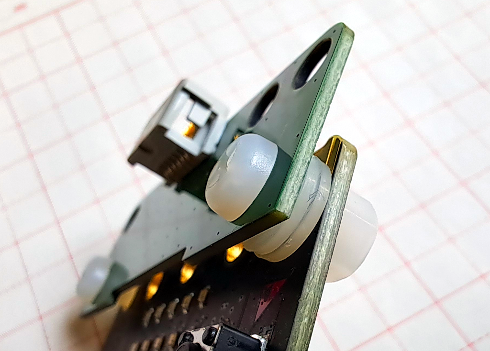

# Q:build

Q:build 是一个 Micro:bit V2 附件板, 将 Micro:bit 转换为可接入树莓派 Build HAT 的设备. Q:build 专门针对 Build HAT 进行设计和测试, 但应该也适用于其它 Hub.

Micro:bit 板载了多种外围设备, 包括按钮, LED 显示屏, 扬声器等用户接口设备, 无线或者蓝牙 (BLE) 通讯, 以及磁场和加速计等传感器. 通过 Q:build, 所有 Micro:bit 功能和传感器数据都能被应用程序所使用.

此外, Q:build 还提供了一颗高精度陀螺仪 (Gyro) 传感器, 用于需求较高的应用场景, 例如, 当 Micro:bit 板载加速计不敷使用时.

## 安装

Q:build 的安装很简单, 只需用配件包中提供的 2 颗螺丝将 Q:build 固定到 Micro:bit, 然后把数据线另一端插入 Hub 即可.

不过有一点需要留意的是, **左侧**螺丝要使用 **2 片**垫片, 目的是保持 Q:build 与 Micro:bit 之间有合适的间距, 见下图. 右侧螺丝无需垫片.

## Micro:bit 固件

用户预期自己编程并下载固件到 Micro:bit. 不过别担心, 我们提供了一个 MakeCode 扩展, 使得这一过程无比轻松! 请访问 pxt-qbuild 了解关于扩展的详细信息, 包括开发指南, API 参考以及示例程序等等: 

    https://github.com/imq-open/pxt-qbuild

